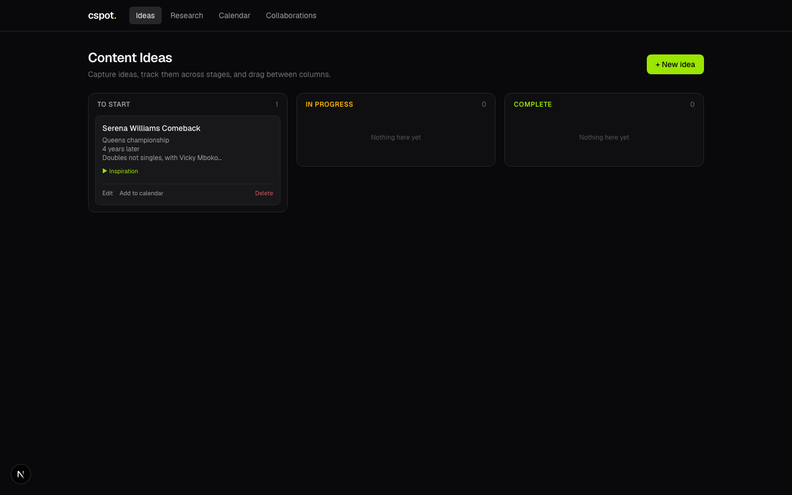
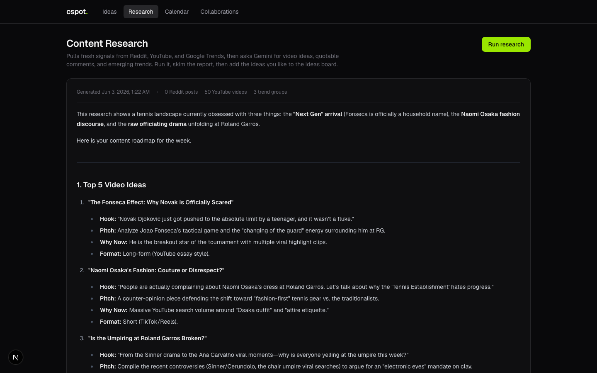
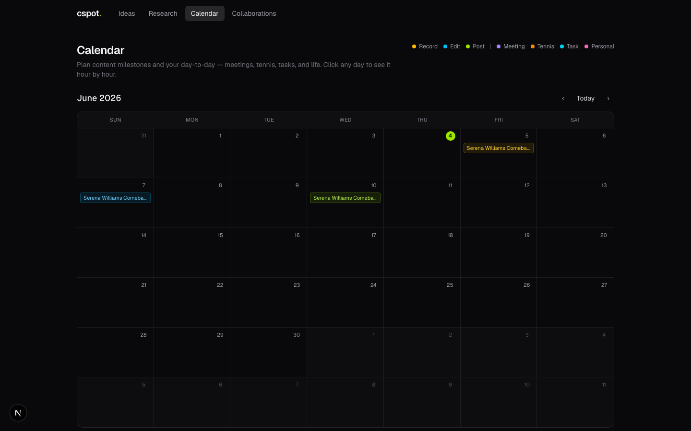
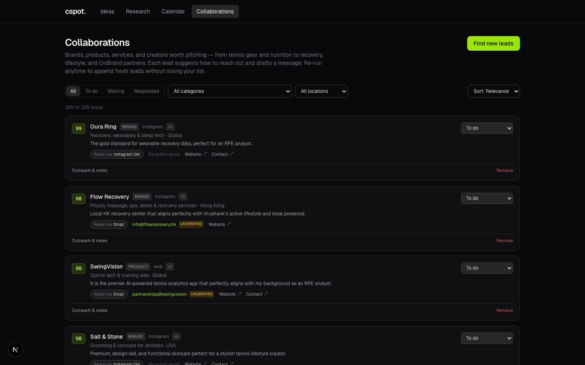

# cspot

An all-in-one content platform for tennis creators. Tracks ideas on a kanban board, pulls live trends from YouTube and Reddit, manages a personal calendar alongside content milestones, and maintains an AI-curated outreach list of 400+ brand collaboration leads — all in a dark-mode web app running locally.

Built for [@vrushwitharacquet](https://instagram.com/vrushwitharacquet) — competitive tennis player, lifestyle creator, and RPE Analyst based in Hong Kong.

---

## Features

### Ideas Board
A drag-and-drop kanban board with three stages: **To Start → In Progress → Complete**. Each card stores a title, notes, category tag, and a target date that optionally pins it to the calendar.



---

### Content Research
One click triggers a Python script that scrapes Reddit, YouTube, and Google Trends, then sends everything to Gemini. The result is a structured weekly brief: top 5 video ideas with hooks and pitches, quotable fan comments, emerging search trends, and cross-platform signals — rendered as a readable report inside the app.



---

### Calendar
A month-grid calendar that doubles as a personal scheduler. Content milestones from the Ideas board appear as colour-coded chips (Record / Edit / Post). Click any day to open an hour-by-hour day view (6 AM–11 PM) where you can create, edit, or delete events across four types: **Meeting**, **Tennis / training**, **Task / reminder**, and **Personal / lifestyle**.



---

### Collaborations
An AI-curated, ever-growing outreach list. A Python script mines 16 brand categories, analyses which brands fellow tennis creators have partnered with, and checks your OnBrand catalogue — producing leads scored 0–100 for relevance. Each lead includes the recommended contact channel (email, Instagram DM, contact form, LinkedIn), a verified or AI-suggested email address, and a ready-to-send outreach message written in your voice. Re-running appends new leads without overwriting existing ones.



---

## Tech Stack

| Layer | Choice |
|---|---|
| Framework | Next.js 16 (App Router, Turbopack), React 19, TypeScript |
| Styling | Tailwind CSS v4 |
| Database | SQLite via `better-sqlite3` (WAL mode, file at `web/data/cspot.db`) |
| Drag-and-drop | dnd-kit |
| Markdown rendering | react-markdown + remark-gfm |
| AI / research | Google Gemini (`gemini-2.0-flash`) via `google-genai` Python SDK |
| YouTube data | YouTube Data API v3 |
| Trend data | Reddit public JSON endpoints · Google Trends via `pytrends` |

---

## Setup

### Prerequisites

- **Node.js** 18+ and **npm**
- **Python 3.10+** (Miniconda or system)
- A **Gemini API key** — free at [aistudio.google.com/apikey](https://aistudio.google.com/apikey)
- A **YouTube Data API v3 key** — free at [console.cloud.google.com](https://console.cloud.google.com) (optional; skipped gracefully if absent)

### 1. Clone

```bash
git clone git@github.com:vrushankvaria01/cspot.git
cd cspot
```

### 2. Python dependencies

```bash
pip install google-genai google-api-python-client pytrends requests python-dotenv beautifulsoup4
```

### 3. Node dependencies

```bash
cd web && npm install
```

### 4. Environment variables

Create a `.env` file in the **project root** (already gitignored):

```
GEMINI_API_KEY=AIza...
YOUTUBE_API_KEY=AIza...        # optional
```

The web app reads the same `.env` at startup.

### 5. Run

```bash
# Terminal 1 — web app (http://localhost:3000)
cd web && npm run dev

# Terminal 2 — run research (one-off, output rendered in the app)
python tennis_content_research.py

# Terminal 3 — find collaboration leads (one-off, appends to DB)
python collaboration_research.py
```

### Tunable environment variables (collaboration script)

| Variable | Default | Effect |
|---|---|---|
| `CSPOT_LEADS_PER_CATEGORY` | 25 | Leads to generate per brand category |
| `CSPOT_CREATOR_PARTNER_LEADS` | 40 | Leads from fellow-creator brand partnerships |
| `CSPOT_ONBRAND_LEADS` | 30 | Leads sourced from OnBrand catalogue |
| `CSPOT_EMAIL_SCAN_MAX` | 40 | Max brands to scrape for a public email |
| `CSPOT_YOUTUBE_MAX_CHANNELS` | 25 | Max YouTube creator channels to analyse |

---

## Engineering Challenges

### Reddit — no official API access needed
Reddit's official API requires approval. All data is fetched from Reddit's **public `.json` endpoints** (e.g. `reddit.com/r/tennis/top.json`) — no credentials, no OAuth. A descriptive `User-Agent` header and a 2-second sleep between requests keeps it within rate limits.

### Gemini model fallback chain
The free-tier Gemini API has per-minute limits that can be hit mid-run. Every AI call runs through a three-model fallback chain — `gemini-2.0-flash` → `gemini-2.0-flash-lite` → `gemini-flash-lite-latest` — with exponential backoff on 429 responses. This means a long collaboration run (400+ leads) completes without manual restarts.

### Incremental collaboration append
Re-running the script must not wipe existing leads, statuses, or notes. Each lead is stored with a `dedupe_key` (normalised name slug). `INSERT OR IGNORE` skips duplicates silently, so re-runs only add genuinely new leads.

### Streaming progress in the browser
The `/api/collaborations/run` route streams newline-delimited JSON (`progress`, `result`, `error` events) over a plain HTTP response using the Web Streams API. The frontend reads chunks incrementally and renders each log line as it arrives — giving real-time feedback during a run that can take several minutes.

### Nested-button hydration error
The original Calendar had day cells as `<button>` elements containing chip `<button>` elements — invalid HTML that caused a React hydration crash. Fixed by converting the outer day cell to `<div role="button" tabIndex={0}>` with keyboard handlers, preserving full accessibility without the nesting violation.

### OnBrand catalogue (JS-gated)
The OnBrand brand directory is rendered client-side behind authentication and can't be statically scraped. The script instead uses Gemini's training knowledge of the OnBrand catalogue, seeded with known brands (`Poppi`, `OLIPOP`, `Liquid Death`, etc.), and flags those leads with `source="onbrand"` so you know to verify and reach out through your OnBrand account.

### Outreach message framing
Early generated messages falsely claimed prior product use ("I've been using your ring for years…"). The fix was a strict rule in the AI system prompt: assume the creator has **not** used the product, frame the ask as genuine interest in trying it and creating UGC. A backfill script then regenerated all 399 existing messages in batches with zero failures.

---

## Project Structure

```
cspot/
├── web/                        # Next.js app
│   ├── app/
│   │   ├── api/
│   │   │   ├── ideas/          # CRUD for content ideas
│   │   │   ├── events/         # CRUD for calendar events
│   │   │   ├── collaborations/ # CRUD + /run streaming endpoint
│   │   │   └── research/       # Research report storage
│   │   ├── components/
│   │   │   ├── Board.tsx        # Kanban board
│   │   │   ├── Calendar.tsx     # Month grid
│   │   │   ├── DayView.tsx      # Hour-by-hour day modal
│   │   │   ├── Collaborations.tsx
│   │   │   ├── LeadCard.tsx
│   │   │   └── ResearchRunner.tsx
│   │   └── (pages)/            # /, /research, /calendar, /collaborations
│   ├── lib/
│   │   ├── db.ts               # SQLite schema + CRUD helpers
│   │   └── types.ts            # Shared TypeScript types
│   └── data/cspot.db           # SQLite database (gitignored)
├── tennis_content_research.py  # Research script
├── collaboration_research.py   # Collaboration lead finder
├── backfill_messages.py        # One-off message rewrite utility
└── .env                        # API keys (gitignored)
```
